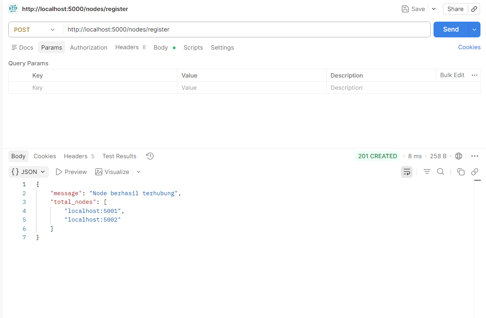
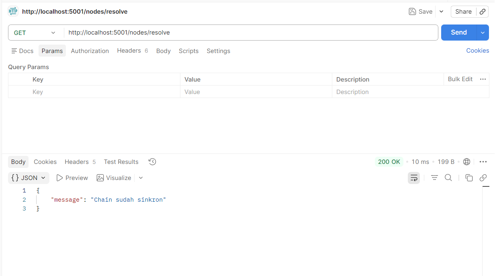
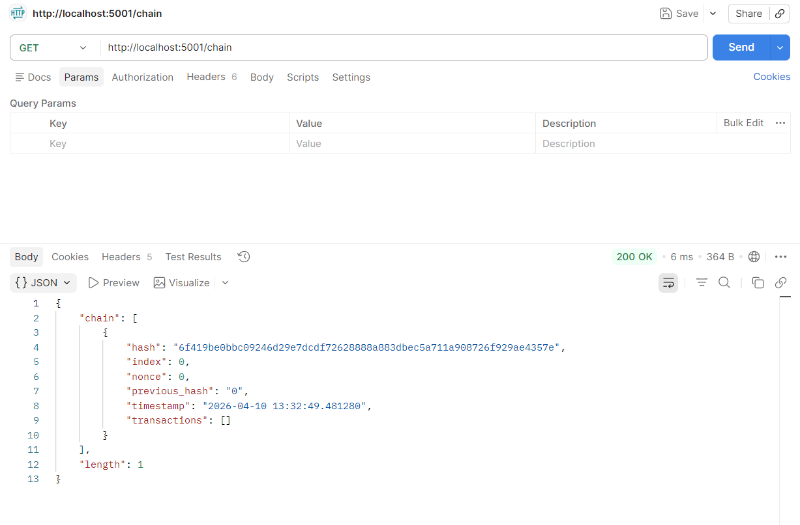

## Langkah 1: Proses Mining & Reward (Node 1)
Setelah transaksi masuk ke pool (pending), kita harus menambangnya ke dalam sebuah Block agar resmi masuk ke Blockchain.

## Langkah 2: Cek Isi Blockchain (Node 1)

## Langkah 3: Simulasi 3 Node (Networking)
 menjalankan 2 node tambahan untuk memenuhi kriteria "Minimal 3 Node".

1. Buka Terminal Baru (Terminal ke-2): Jalankan python blockchain_node.py --port 5001.
2. Buka Terminal Baru (Terminal ke-3): Jalankan python blockchain_node.py --port 5002.
3. Daftarkan Node di Postman:

## Langkah 4: Sinkronisasi (Consensus)
Saat ini, Node 5001 dan 5002 masih kosong (hanya punya Genesis Block), sedangkan Node 5000 sudah punya 2 block. Kita akan mensinkronkan mereka.

Di Postman: Panggil GET http://localhost:5001/nodes/resolve

Cek Node 5001: Panggil GET http://localhost:5001/chain. Sekarang isinya akan sama dengan Node 5000.

